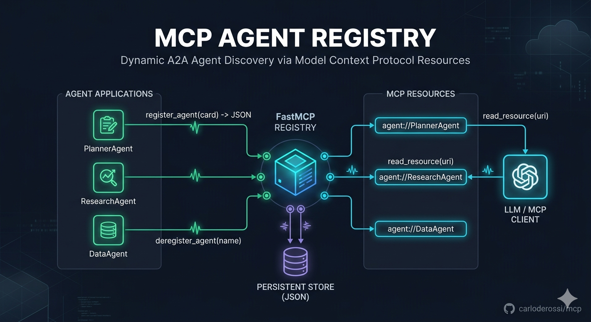

**FastMCP-based Agent Registry** 

* AI Agents can be registered and deregistered dynamically via MCP tools.
* AgentCards are persisted in a JSON registry.
* Each AgentCard is exposed as an MCP Resource.
* Resources use an A2A-style URI scheme (`agent://<agent-name>`).
* Clients can discover available agents through MCP resource listing and retrieve individual AgentCards.



# MCP Agent Registry

A FastMCP-based server for dynamic registration and deregistration of AI Agents.

The server exposes AgentCards as MCP Resources using an A2A-inspired URI scheme, enabling agent discovery and interoperability between MCP and Agent-to-Agent (A2A) ecosystems.

## Overview

This project demonstrates how MCP can be used as an Agent Registry.

Agents can:

- Register themselves dynamically
- Deregister themselves when unavailable
- Publish AgentCards as MCP Resources
- Be discovered through MCP resource enumeration
- Expose metadata compatible with A2A-style agent discovery

The registry is persisted locally in JSON and synchronized with FastMCP resources at startup.

---

## Architecture

```text
                    +----------------------+
                    |     MCP Clients      |
                    +----------+-----------+
                               |
                               |
                               v
                  +--------------------------+
                  |     FastMCP Registry     |
                  +--------------------------+
                  | Tools                    |
                  |  - register_agent()      |
                  |  - deregister_agent()    |
                  +------------+-------------+
                               |
                               |
                               v
                  +--------------------------+
                  |     AgentCard Store      |
                  |  agents_registry.json    |
                  +------------+-------------+
                               |
                               |
                               v
                  +--------------------------+
                  |      MCP Resources       |
                  | agent://PlannerAgent     |
                  | agent://ResearchAgent    |
                  | agent://DataAgent        |
                  +--------------------------+
````

---

## Key Concepts

### AgentCard

An AgentCard contains metadata describing an AI Agent.

Example:

```json
{
  "name": "PlannerAgent",
  "url": "http://localhost:9000",
  "description": "Task planning agent",
  "version": "1.0.0"
}
```

### Resource URI

Each AgentCard is exposed as an MCP Resource:

```text
agent://PlannerAgent
agent://ResearchAgent
agent://DataAgent
```

Clients can:

1. List resources
2. Discover available agents
3. Retrieve AgentCards

---

## Features

* Dynamic agent registration
* Dynamic agent deregistration
* Persistent JSON registry
* MCP Resource discovery
* A2A-compatible AgentCard serving
* Streamable HTTP transport
* FastMCP implementation

---

## Project Structure

```text
basic_101_mcp/

├── mini_mcp_server.py
├── mini_mcp_client.py
├── add_agentcard_client.py
├── remove_agentcard_client.py
├── mcp_client_list.py
└── agents_registry.json
```

### Components

| File                       | Purpose                  |
| -------------------------- | ------------------------ |
| mini_mcp_server.py         | MCP registry server      |
| add_agentcard_client.py    | Register AgentCards      |
| remove_agentcard_client.py | Deregister AgentCards    |
| mcp_client_list.py         | List available resources |
| mini_mcp_client.py         | Generic MCP client       |
| agents_registry.json       | Persistent registry      |

---

## Installation

### Prerequisites

* Python 3.13+
* uv

### Clone

```bash
git clone https://github.com/carloderossi/mcp.git
cd mcp
```

### Install Dependencies

```bash
uv sync
```

or

```bash
pip install -e .
```

---

## Dependencies

* FastMCP
* MCP SDK
* FastAPI
* Uvicorn
* A2A SDK
* aiohttp

---

## Running the Server

```bash
python basic_101_mcp/mini_mcp_server.py
```

The server starts on:

```text
http://127.0.0.1:8080/mcp
```

Transport:

```text
Streamable HTTP
```

---

## Registering an Agent

Tool:

```python
register_agent(card)
```

Example payload:

```json
{
  "name": "PlannerAgent",
  "url": "http://localhost:9000",
  "description": "Planning agent",
  "version": "1.0.0"
}
```

Result:

```text
Registered PlannerAgent
```

The AgentCard is:

1. Stored in agents_registry.json
2. Added as an MCP Resource
3. Immediately discoverable by clients

---

## Deregistering an Agent

Tool:

```python
deregister_agent(name)
```

Example:

```python
deregister_agent("PlannerAgent")
```

Result:

```text
Deregistered PlannerAgent
```

The AgentCard is:

1. Removed from persistent storage
2. Removed from FastMCP resources
3. No longer discoverable

---

## Resource Discovery

Clients can list available resources.

Example:

```text
agent://PlannerAgent
agent://ResearchAgent
agent://DataAgent
```

To retrieve a specific AgentCard:

```text
agent://PlannerAgent
```

Response:

```json
{
  "name": "PlannerAgent",
  "url": "http://localhost:9000",
  "description": "Planning agent",
  "version": "1.0.0"
}
```

---

## MCP ↔ A2A Integration Pattern

This project demonstrates a useful interoperability pattern:

```text
A2A Agent
    |
    | publishes
    v
AgentCard
    |
    v
MCP Resource
    |
    v
MCP Client Discovery
```

This allows MCP clients to discover A2A-capable agents without requiring a separate registry service.

---

## Future Enhancements

* Full A2A AgentCard schema validation
* Agent health monitoring
* Agent heartbeat mechanism
* Automatic expiration of stale agents
* Agent capability filtering
* Authentication and authorization
* Distributed registry backend
* Azure AI Foundry integration
* Semantic Kernel integration
* LangGraph integration

---

## Use Cases

### Multi-Agent Systems

Dynamic discovery of:

* Planning agents
* Research agents
* Coding agents
* Evaluation agents

### Enterprise Agent Registry

Centralized catalog of:

* Internal AI services
* MCP tools
* A2A agents

### AI Architecture Demonstrations

Useful for showcasing:

* MCP
* A2A
* Agent discovery
* Agent interoperability
* Agent orchestration patterns

---

## License

MIT

```

For your AI Architect portfolio, I would also add a section called **"Architecture Decisions"** explaining *why MCP Resources were chosen as the registry abstraction instead of a traditional REST catalog*. That design choice is the most distinctive aspect of this project and is exactly the kind of thing interviewers for AI Architect roles tend to ask about.
```
